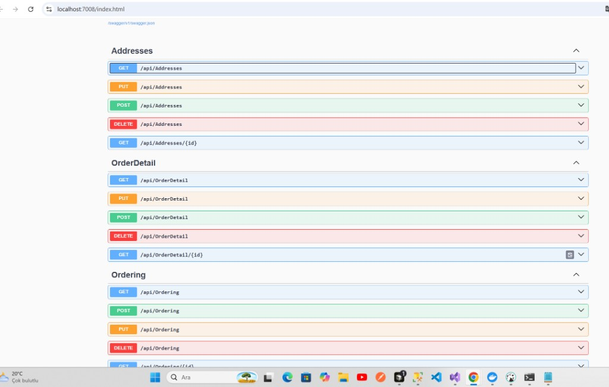

# MultiShop

ASP.NET Core 9 mikroservis e-ticaret projesi. Catalog (MongoDB), Discount (Dapper + SQL Server), Order (CQRS + EF Core), Cargo (EF Core), Basket (Redis) ve Duende IdentityServer ile JWT korumalı API’ler içerir.

Repo: [github.com/MahirAKSIN/MultiShop](https://github.com/MahirAKSIN/MultiShop)

---

## Servisler

| Servis | Veri katmanı | Açıklama |
|---|---|---|
| **Catalog** | MongoDB | Kategori, ürün, ürün detayı, ürün görseli CRUD (JWT) |
| **Discount** | Dapper + SQL Server | Kupon CRUD (JWT) |
| **Order** | EF Core + CQRS | Adres, sipariş detayı (OrderDetail), sipariş (Ordering) |
| **Cargo** | EF Core + SQL Server | Kargo şirketi, müşteri, detay, operasyon CRUD |
| **Basket** | Redis | Sepet kaydetme / okuma / silme (`StackExchange.Redis`) |
| **IdentityServer** | ASP.NET Identity + SQL Server | Duende IS — token, kullanıcı kaydı, API resource/scope |

Hedef framework: **.NET 9.0**

---

## 0. IdentityServer ve JWT yetkilendirme

Duende IdentityServer (`IdentityServer/MultiShop.IdentityServer`) access token üretir. Catalog, Discount ve Basket API’leri `JwtBearer` ile bu token’ı doğrular.

### ApiResource / Scope

| ApiResource (`aud`) | Scope’lar |
|---|---|
| `ResourceCatalog` | `CatalogReadPermission`, `CatalogFullPermission` |
| `ResourceDiscount` | `DiscountReadPermission`, `DiscountFullPermission` |
| `ResourceOrder` | `OrderReadPermission`, `OrderFullPermission` |
| `ResourceCargo` | `CargoFullPermission` |
| `ResourceBasket` | `BasketFullPermission` |

`HostingExtensions` içinde `AddInMemoryApiResources(Config.ApiResources)` kayıtlı olmalı; aksi halde token `aud` değeri yanlış olur ve API **401** döner.

### Client’lar

| ClientId | Secret | Grant | Tipik scope |
|---|---|---|---|
| `MultiShopVisitorId` | `multishopsecret` | client_credentials | Discount |
| `MultiShopManagerId` | `multishopsecret` | password | Catalog + Discount |
| `MultiShopAdminId` | `multishopsecret` | password + client_credentials | Tüm API’ler (Basket, Cargo, Order…) |

### Token alma — Catalog (örnek)

```text
POST http://localhost:5001/connect/token
Content-Type: application/x-www-form-urlencoded

client_id=MultiShopAdminId
client_secret=multishopsecret
grant_type=client_credentials
scope=CatalogReadPermission
```

### Token alma — Basket (password)

```text
POST http://localhost:5001/connect/token

client_id=MultiShopAdminId
client_secret=multishopsecret
grant_type=password
username=<kullanıcı>
password=<şifre>
scope=BasketFullPermission openid profile
```

jwt.io’da `aud` ilgili resource ile eşleşmeli; Duende token tipi `at+jwt`. Basket için `sub` claim’i (kullanıcı id) gerekir.

### API tarafı (Catalog / Discount / Basket)

- `Authority`: `IdentityServerUrl` → `http://localhost:5001`
- `ValidAudience`: `ResourceCatalog` / `ResourceDiscount` / `ResourceBasket`
- `ValidTypes`: `at+jwt`
- `RequireHttpsMetadata = false` (local)
- Pipeline: `UseAuthentication` → `UseAuthorization`

### Çalıştırma

```bash
dotnet run --project IdentityServer/MultiShop.IdentityServer
```

- IdentityServer: `http://localhost:5001`
- Catalog (JWT): `https://localhost:7231` — örn. `GET /api/Categories` + Bearer
- Discount (JWT): `https://localhost:7108` — örn. `GET /api/Discounts` + Bearer
- Basket (JWT): `https://localhost:7074` — örn. `POST /api/Basket` + Bearer

---

## 1. Catalog servisi

Katmanlı yapı: entity, DTO, AutoMapper, servis, controller. MongoDB üzerinde çalışır.

### Entity / koleksiyonlar

| Sınıf | Koleksiyon | Ana alanlar |
|---|---|---|
| `Category` | Categories | `CategoryId`, `CategoryName` |
| `Product` | Products | `ProductName`, `ProductPrice`, `ProductImageUrl`, `ProductDescription`, `CategoryId` |
| `ProductDetail` | ProductDetails | `ProductDescription`, `ProductInfo`, `ProductId` |
| `ProductImage` | ProductImages | `Images1`, `Images2`, `Images3`, `ProductId` |

`[BsonIgnoreExtraElements]` ile belgede fazla alan olsa bile deserialize patlamaz.

### DTO

- `Create*Dto` — ekleme (Id yok)
- `Update*Dto` — güncelleme (Id var)
- `Result*Dto` — liste
- `GetById*Dto` — tek kayıt

### Servisler

`ICategoryService`, `IProductServices`, `IProductDetailService`, `IProductImageServices` — her biri kendi MongoDB koleksiyonunu kullanır.

### API

| HTTP | Route | Açıklama |
|---|---|---|
| GET | `/api/Categories` | Liste |
| GET | `/api/Categories/{id}` | Tek kayıt |
| POST | `/api/Categories` | Ekle |
| PUT | `/api/Categories` | Güncelle |
| DELETE | `/api/Categories?id=` | Sil |

Aynı kalıp: `Product`, `ProductDetail`, `ProductImage`.

### Paketler

| Paket | Sürüm | Ne işe yarar? |
|---|---|---|
| AutoMapper | 16.2.0 | Entity ↔ DTO |
| MongoDB.Driver | 2.30.0 | MongoDB CRUD |
| MongoDB.Bson | 2.30.0 | BSON / `[BsonId]` |
| MongoDB.Driver.Core | 2.30.0 | Düşük seviye sürücü |
| Swashbuckle.AspNetCore | 9.0.6 | Swagger UI |
| Microsoft.AspNetCore.OpenApi | 9.0.17 | OpenAPI belgesi |

### Çalıştırma

```bash
dotnet run --project Services/Catalog/MultiShop.Catalog
```

- HTTPS: `https://localhost:7231`
- HTTP: `http://localhost:5149`
- Swagger: `https://localhost:7231/swagger`
- MongoDB: `mongodb://localhost:27017` / `MultiShopCatalogDb`

---

## 2. Discount servisi

SQL Server + Dapper ile kupon CRUD. EF Core yalnızca migration / tablo oluşturmak için kullanılır; runtime sorgular Dapper ile gider.

### Entity

`Coupon`: `CouponId`, `Code`, `Rate`, `IsActive`, `Validate`

### Yapı

- `DapperContext` — connection string + `createConnection()`
- `IDiscountService` / `DiscountService` — SQL CRUD
- `DiscountsController` — REST API

### API

| HTTP | Route |
|---|---|
| GET | `/api/Discounts` |
| GET | `/api/Discounts/{id}` |
| POST | `/api/Discounts` |
| PUT | `/api/Discounts` |
| DELETE | `/api/Discounts/{id}` |

### Paketler

| Paket | Sürüm | Ne işe yarar? |
|---|---|---|
| Dapper | 2.1.79 | Hafif SQL erişimi |
| Microsoft.EntityFrameworkCore | 9.0.19 | Migration / DbContext |
| Microsoft.EntityFrameworkCore.SqlServer | 9.0.19 | SQL Server provider |
| Microsoft.EntityFrameworkCore.Design / Tools | 9.0.19 | `Add-Migration`, `Update-Database` |
| Swashbuckle.AspNetCore | 9.0.6 | Swagger UI |
| Microsoft.AspNetCore.OpenApi | 9.0.17 | OpenAPI |

> Not: EF Core **10.x** yalnızca `net10.0` ile uyumludur. Proje `net9.0` olduğu için **9.0.x** kullanılmalıdır.

### Çalıştırma

```bash
dotnet run --project Services/Discount/MultiShop.Discount
```

- HTTPS: `https://localhost:7108`
- HTTP: `http://localhost:5259`
- Swagger kök adreste açılır
- DB: `MultiShopDiscount` (SQL Server, Windows auth)

Migration:

```powershell
Add-Migration mig1 -StartupProject MultiShop.Discount -Project MultiShop.Discount
Update-Database -StartupProject MultiShop.Discount -Project MultiShop.Discount
```

---

## 3. Order servisi

Clean Architecture + CQRS. Katmanlar:

| Proje | Rol |
|---|---|
| `MultiShop.Order.Domain` | Entity’ler: `Address`, `Ordering`, `OrderDetail` |
| `MultiShop.Order.Application` | CQRS Commands / Queries / Handlers / Results, `IRepository` |
| `MultiShop.Order.Infrastructure` | `OrderContext` (EF Core), `Repository` |
| `MultiShop.Order.Presention` | API controller’lar |

### Domain

- **Address:** `AddressId`, `UserId`, `District`, `City`, `Detail`
- **Ordering:** `OrderingId`, `UserId`, `TotalPrice`, `OrderDate`, `OrderDetails`
- **OrderDetail:** `OrderDetailId`, `ProductId`, `ProductName`, `ProductPrice`, `ProductAmount`, `ProductTotalPrice`, `OrderingId`

### CQRS klasör yapısı

```
Features/CQRS/
├── Commands/
│   ├── AddressCommands/
│   ├── OrderDetailCommands/
│   └── OrderingCommands/
├── Handlers/
│   ├── AddressHandlers/
│   ├── OrderDetailHandlers/
│   └── OrderingHandlers/
├── Queries/
│   ├── AddressQueries/
│   ├── OrderDetailQueries/
│   └── OrderingQueries/
└── Results/
    ├── AddressResults/
    ├── OrderDetailResults/
    └── OrderingResults/
```

Her kaynak için tipik dosyalar:

- Commands: Create / Update / Remove (Delete)
- Queries: GetById (+ liste query)
- Results: Get*QueryResult, Get*ByIdQueryResult
- Handlers: Create / Update / Remove / GetAll / GetById

### Infrastructure

- `OrderContext` — EF Core `DbContext`
- `Repository<T>` — `IRepository<T>` implementasyonu (`GetAllAsync`, `GetByIdAsync`, `CreateAsync`, `UpdateAsync`, `DeleteAsync`, `GetByFilterAsync`)

### API (Presention)

- `AddressesController`
- `OrderDetailController`
- `OrderingController`

Swagger UI (Addresses, OrderDetail, Ordering):



### Paketler

| Paket | Sürüm | Ne işe yarar? |
|---|---|---|
| Microsoft.EntityFrameworkCore | 9.0.0 | ORM |
| Microsoft.EntityFrameworkCore.SqlServer | 9.0.0 | SQL Server |
| Microsoft.EntityFrameworkCore.Design / Tools | 9.0.0 | Migration araçları |
| Microsoft.AspNetCore.OpenApi | 9.0.17 | OpenAPI (Presention) |
| Swashbuckle.AspNetCore | 9.0.6 | Swagger UI |

### Çalıştırma

```bash
dotnet run --project Services/Order/Presention/MultiShop.Order.Presention
```

- HTTPS: `https://localhost:7008`
- HTTP: `http://localhost:5123`
- Swagger kök adreste açılır (`https://localhost:7008`)

---

## 4. Basket servisi (Redis)

Sepet verisi SQL yerine **Redis** üzerinde tutulur. JWT zorunlu; kullanıcı id’si token’daki `sub` (veya `client_id`) claim’inden alınır ve Redis key olarak kullanılır.

### Yapı

| Parça | Rol |
|---|---|
| `RedisSettings` | `Host`, `Port` (`appsettings.json`) — Options ile bağlanır |
| `RedisService` | `StackExchange.Redis` (`Connect`, `Getdb`) — Singleton |
| `IBasketServices` / `BasketService` | `SaveBasket`, `GetBasket`, `DeleteBasket` |
| `ILoginService` / `LoginService` | Token’dan kullanıcı id (`sub`) |
| `BasketController` | REST API (`[Authorize]`) |
| `BasketTotalDto` / `BasketItemDto` | Sepet + kalem DTO’ları |

> DI notu: `Configure<RedisSettings>` kullanılmalı. `Configure<RedisService>` parametresiz ctor ister → `MissingMethodException`.

### API

| HTTP | Route | Açıklama |
|---|---|---|
| GET | `/api/Basket` | Giriş yapan kullanıcının sepeti |
| POST | `/api/Basket` | Sepeti kaydet / güncelle |
| DELETE | `/api/Basket` | Sepeti sil |

### POST body örneği

`UsreId` body’de **gönderilmez** (opsiyonel); sunucu token’dan yazar. `productId` sayı olmalı.

```json
{
  "discountCode": "Yok",
  "discountRate": 0,
  "basketItems": [
    {
      "productId": 1,
      "productName": "Bilgisayar",
      "quantity": 1,
      "price": 15000
    }
  ]
}
```

Postman: `Authorization: Bearer <access_token>`, URL: `https://localhost:7074/api/Basket` (HTTP: `http://localhost:5241`).

### Servis metotları

| Metot | Redis işlemi |
|---|---|
| `SaveBasket` | `StringSetAsync(userId, json)` |
| `GetBasket` | `StringGetAsync(userId)` → deserialize (boşsa `null`) |
| `DeleteBasket` | `KeyDeleteAsync(userId)` |

### Paketler

| Paket | Sürüm | Ne işe yarar? |
|---|---|---|
| StackExchange.Redis | 3.2.1 | Redis istemcisi |
| Microsoft.AspNetCore.Authentication.JwtBearer | 9.0.0 | JWT |
| Swashbuckle.AspNetCore | 9.0.6 | Swagger UI (kök adres) |
| Microsoft.AspNetCore.OpenApi | 9.0.17 | OpenAPI |

### Ayarlar (`appsettings.json`)

```json
"RedisSettings": {
  "Host": "localhost",
  "Port": 6379
},
"IdentityServerUrl": "http://localhost:5001"
```

### Çalıştırma

Redis’in ayakta olması gerekir (`localhost:6379`).

```bash
dotnet run --project Services/Basket/MultiShop.Basket
```

- HTTPS: `https://localhost:7074`
- HTTP: `http://localhost:5241`
- Swagger kök adreste açılır
- JWT audience: `ResourceBasket`

---

## Klasör yapısı

```
MultiShop/
├── MultiShop.sln
├── README.md
├── IdentityServer/MultiShop.IdentityServer/
└── Services/
    ├── Basket/MultiShop.Basket/
    ├── Cargo/
    ├── Catalog/MultiShop.Catalog/
    ├── Discount/MultiShop.Discount/
    └── Order/
        ├── Core/
        │   ├── MultiShop.Order.Domain/
        │   ├── MultiShop.Order.Application/
        │   ├── MultiShop.Order.Infrastructure/
        │   └── MultiShop.Order.WebApi/
        └── Presention/MultiShop.Order.Presention/
```

---

## Karşılaşılan hatalar ve çözümleri

| Hata | Neden | Çözüm |
|---|---|---|
| `Unable to resolve IDatabaseSettings` | DI’ye arayüz kaydedilmemişti | `AddSingleton<IDatabaseSettings>` |
| `ReflectionTypeLoadException` | AutoMapper `AddMaps` tüm assembly’yi tarıyordu | `AddProfile<GeneralMapping>()` |
| `UseSwagger` / `AddSwaggerGen` CS1061 | Swashbuckle paketi yoktu | `Swashbuckle.AspNetCore 9.0.6` |
| `Element 'ProductImageUrl' does not match ProductDetail` | Yanlış MongoDB koleksiyonu | Her servise kendi koleksiyon adı |
| `Element 'ProductName' does not match Category` | Eski karışık belgeler | `[BsonIgnoreExtraElements]` + filtre |
| EF Core 10.x restore hatası | `net9.0` ile uyumsuz | EF Core **9.0.x** kullan |
| Migration Startup Project hatası | Catalog seçiliydi | Startup: `MultiShop.Discount` |
| Swagger conflicting GET path | İki `[HttpGet]` aynı route | `GET {id}` ayır |
| `Cannot perform runtime binding on a null reference` | Dapper generic tip yoktu | `QueryFirstOrDefaultAsync<T>` |
| Catalog/Discount API **401** | `ApiResources` IS’a eklenmemiş / yanlış `aud` / eski token | `AddInMemoryApiResources` + `ValidAudience` + `ValidTypes = at+jwt` + yeni token |
| Visitor ile Discount gelmiyor | Yanlış scope (Catalog) veya Visitor’da olmayan scope | `MultiShopVisitorId` + `scope=DiscountReadPermission` |
| Basket Redis `MissingMethodException` | `Configure<RedisService>` Options parametresiz ctor ister | `Configure<RedisSettings>` + `new RedisService(Host, Port)` + `Connect()` |
| Basket **401** | Token’da `scope=BasketFullPermission` yok / Bearer yok | Password grant + scope; jwt.io’da `aud=ResourceBasket` |
| Basket POST **400** `UsreId required` | Non-nullable string validation action’dan önce çalışır | `UsreId` nullable; sunucu token `sub` ile set eder |
| Cargo `ObjectDisposedException` | Repository’de `async void` + `SaveChangesAsync` | Senkron `SaveChanges()` |
